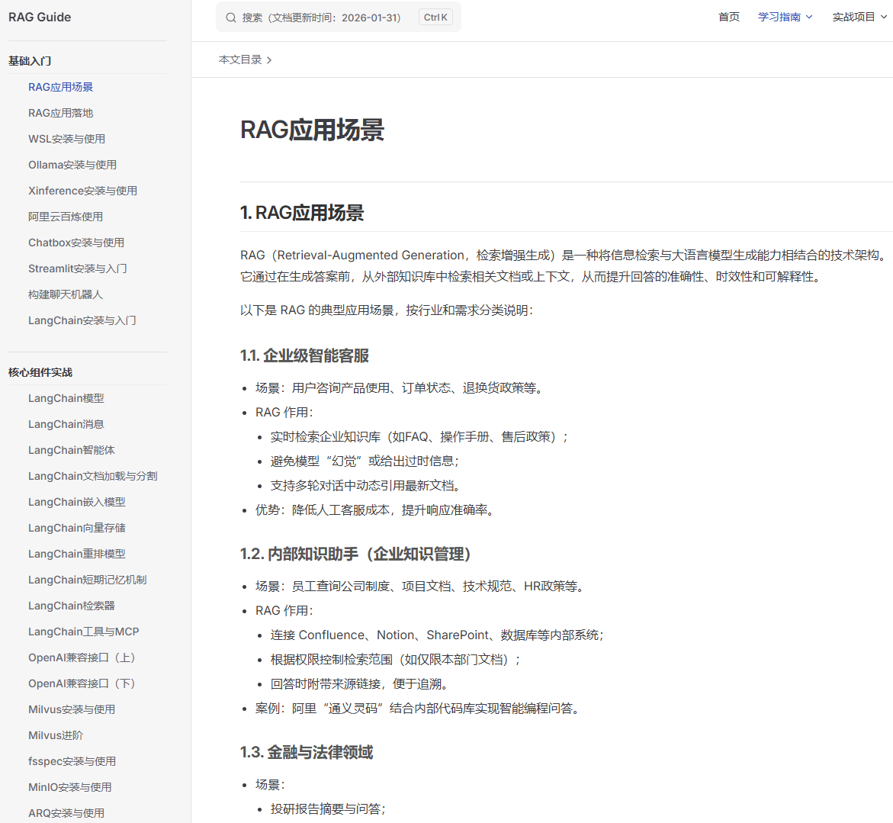

<h1 align="center" style="margin: 30px 0 15px; font-weight: bold;">RAG从入门到实战</h1>
<h3 align="center" style="margin: 0 0 30px;">RAG 开发者的一站式手册</h3>

## 📚 项目简介

本项目定位为**RAG（Retrieval-Augmented Generation，检索增强生成）开发者的一站式手册**，旨在打破RAG技术学习中的“知识碎片化”和“理论与实践脱节”问题。

从基础概念拆解到生产级项目落地，从核心组件选型到性能优化技巧，我们将用“可复现的代码”+“清晰的逻辑解析”+“真实场景案例”，帮你系统掌握RAG技术，快速具备从0到1搭建RAG应用的能力。

> 点击右上角的⭐Star支持我们，你的认可就是我们持续更新的动力！

## 🎯 适用人群

- AI/大模型领域新手：想入门RAG技术，却被复杂概念和多样工具劝退的开发者；

- Python工程师：希望拓展大模型应用开发能力，落地RAG相关业务的技术人员；

- 产品/算法经理：需要快速理解RAG技术原理与落地边界，推进相关产品落地的从业者；

- 高校学生/研究者：寻找系统RAG学习资料，完成课程作业或科研项目的学习者。

## 🔧 技术栈说明（全异步高性能）

- 后端框架：Python + FastAPI（异步架构，高并发）
- ORM 层：SQLAlchemy 2.0（异步版，适配企业级数据操作）
- RAG 核心：LangChain 1.2.4 （最新稳定版）
- 大模型适配：Ollama（本地）、Xinference（本地）、OpenAI、腾讯混元、通义千问等
- 嵌入模型：bge-m3、bge-large-zh-v1.5、text-embedding-3等
- 向量数据库：Milvus、Pinecone等
- SQL 数据库：MySQL、PostgreSQL等
- 部署适配：Docker/Docker Compose/K8S（开发 / 生产环境一键适配）

## 🚀 快速开始

**👉 [完整RAG开发手册](https://rag.marsmgn.cn/)**

## 📋 内容结构

本项目按“学习路径”分为5大模块，建议从第一模块开始逐步学习，也可根据自身基础直接跳转对应内容：

### 模块一：RAG基础入门（01_basic_introduction）

1. **什么是RAG**：拆解RAG的核心逻辑、与传统大模型应用的区别、适用场景与局限性；

2. **RAG核心流程**：从“数据加载→预处理→向量存储→检索→生成”全流程解析；

3. **必备技术栈**：Python基础、大模型API使用、向量数据库核心概念快速入门；

4. **环境搭建**：Anaconda/Python环境配置、关键依赖（LangChain、OpenAI SDK等）安装指南。

### 模块二：RAG核心组件实战（02_core_components）

1. **数据处理模块**：PDF/Word/Excel/TXT等多格式文件加载、文本分割（语义分割vs字符分割）最佳实践；

2. **向量嵌入模块**：主流Embedding模型（OpenAI Embedding、讯飞星火Embedding、开源BGE等）对比与调用；

3. **向量数据库模块**：Milvus/Pinecone/FAISS等主流数据库部署、增删改查与性能对比；

4. **检索模块**：单轮检索、多轮检索、混合检索（关键词+语义）实现技巧；

5. **生成模块**：大模型调用（GPT/文心一言/通义千问）、Prompt工程优化、结果格式化输出。

### 模块三：RAG经典框架应用（03_framework_practice）

1. **LangChain实战**：用LangChain快速搭建基础RAG应用、核心组件（Chain/Agent）使用技巧；

2. **LlamaIndex实战**：针对复杂文档的RAG应用开发、索引优化与查询增强；

3. **框架对比**：LangChain vs LlamaIndex 适用场景与选型建议。

### 模块四：生产级RAG项目落地（04_production_projects）

每个项目包含“需求分析→架构设计→代码实现→部署上线”全流程，附详细注释与优化思路：

1. **项目1：企业知识库问答系统** - 支持多格式文档上传、模糊查询、来源溯源，适配中小团队内部使用；

2. **项目2：智能客服对话机器人** - 基于多轮对话记忆、领域知识库，实现精准问题解答与意图识别；

3. **项目3：学术论文问答工具** - 针对PDF格式论文，支持公式识别、章节关联查询，辅助科研效率提升；

4. **项目4：RAG+Agent智能助手** - 结合Agent能力，实现“检索→推理→执行”闭环，处理复杂任务。

### 模块五：RAG性能优化与进阶（05_optimization_advanced）

1. **检索优化**：向量索引优化、查询重写、相关性排序算法调优；

2. **生成优化**：Prompt模板工程、多模型协同、幻觉抑制技巧；

3. **性能监控**：检索准确率、生成相关性、响应速度等核心指标监控方案；

4. **高级主题**：RAG与Fine-tuning结合、多模态RAG（图文检索）、私有化部署方案。

##  📄 许可证

本项目采用 **MIT License**开源许可协议，允许个人或企业自由使用、修改、分发本项目代码，商用无需保留原作者信息与许可证说明。

## 🌟 致谢

本项目的开发与完善，离不开以下开源社区与技术团队的支持：

- LangChain/LlamaIndex/FastAPI 开源社区：提供了强大的RAG开发框架；
- 各大大模型厂商：提供了便捷的API服务与技术支持；
- RAG领域的研究者与分享者：为技术普及提供了丰富的参考资料。
